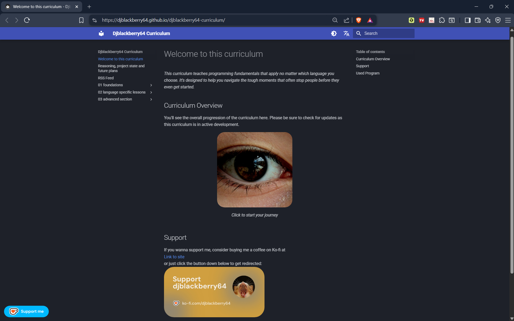

# Welcome to my curriculum!

I sincerely appreciate that you're here and want to build some solid fundamentals in software development. Don't worry there will be additional resources at the end so that you can continue with that momentum!

## What you should know beforehand

This is a curriculum that uses:

- storytelling and metaphors as its main teaching methods
- walks you through the topics one by one to ensure understanding builds up over time

If you're looking for a dry reference you're at the wrong place.

## Why or how is this useful for you?

This curriculum aims at building solid fundamentals before you even touch the code. 
It explains core concepts and uses different programming languages as examples of how these fundamentals get executed in different programming languages e.g. Statically vs. Dynamically typed languages.

This course uses self shot photography, a storyline as well as simple language to make the learning experience more pleasant for y'all.

Here is the link to the site: <a href="https://djblackberry64.github.io/djblackberry64-curriculum/">Hosted curriculum online</a>

Here is the link to the beta version of the new site (made with another program): <a href="https://github.com/djblackberry64/programming-fundamentals-course">Hosted beta online</a>

## How to self-host this project

To self-host this project you will need to [install](https://www.mkdocs.org/user-guide/installation/) mkdocs via pip. After that you will need to install the different extensions used in this project found in the mkdocs.yml file. The files and folders relevant to achieve a self-host are the folders: docs, overrides as well as the files mkdocs.yml, .gitignore and the two licenses this project uses.

## A quick look at the project

## "I wanna use the assets in this curriculum for commercial purposes"

Hey I don't mind you using the assets for your non-commercial projects. 

However, if you wanna use them commercially visit [Ko-fi](https://ko-fi.com/djblackberry64) for a commercial license. 

Take care and good luck with your projects!

## Achievements

- This project was extended during Hack Club's Flavortown (Spring 2026) and earned me an ESP32 Kit and exclusive community merch.
